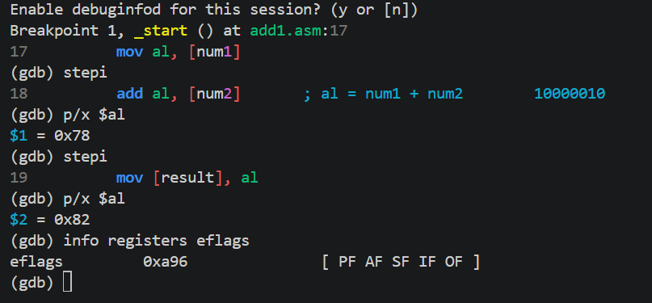
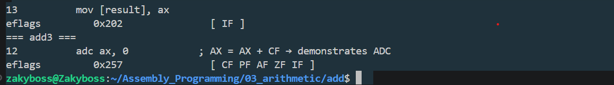

### Program 1: `add1.asm`

Adds two 8-bit numbers, `120 (0x78)` and `10 (0x0A)`, in `AL` and stores the result in memory. I stepped through it with `stepi` and checked `info registers eflags` after each instruction.

### Flags as the program runs

- **Start of `_start`:** `[ IF ]`. Interupt Flag is set by the OS, and the arithmetic flags are all clear.
- **`mov al, [num1]`:** `AL = 0x78`, flags unchanged. `MOV` only copies data and never touches the arithmetic flags.
- **`add al, [num2]`:** `AL = 0x82`, flags become `[ PF AF SF IF OF ]`. This is the only instruction that changes them.
- **`mov [result], al`:** flags unchanged, so the flags from the `add` are still readable.
- **`xor ebx, ebx`:** flags become `[ PF ZF IF ]`. `XOR` overwrites the results of the `add`, so flags only describe the most recent instruction that affects them.

### Why each flag after the `add`

`01111000 + 00001010 = 10000010` (`0x82`, which is 130 unsigned and -126 signed)

- **CF cleared:** there was no carry out of bit 7. 130 fits in 8 bits unsigned (max 255).
- **ZF cleared:** the result is not zero.
- **SF set:** bit 7 of the result is 1.
- **OF set:** two positive numbers produced a negative result. +130 is above the signed 8-bit maximum of +127, so it wrapped to -126.
- **PF set:** the low byte `10000010` has two 1-bits, which is an even count.
- **AF set:** the low nibbles `0x8 + 0xA = 0x12` carried out of bit 3.
CF = 0 but OF = 1. The result is fine as an unsigned number but overflows as a signed one. CF tracks unsigned overflow and OF tracks signed overflow, and they are independent.

## Program 2: `add3.asm`

Adds `0xFFFF` (65535) and `1` in the 16-bit register `AX`, then uses `ADC` to add the carry back in. I stepped through it with `stepi` and checked `info registers eflags` after each instruction.

### Flags as the program runs

- **`mov ax, [num1]`:** `AX = 0xFFFF`, flags stay `[ IF ]`. `MOV` doesn't touch the arithmetic flags.
- **`add ax, [num2]`:** `AX = 0x0000`, flags become `[ CF PF AF ZF IF ]`.
- **`adc ax, 0`:** `AX = 0x0001`, flags go back to `[ IF ]`.
- **`mov [result], ax`:** flags unchanged.

### Why each flag after `add ax, [num2]`

`1111111111111111 + 0000000000000001 = 1 0000000000000000`

The true sum is 17 bits wide, and `AX` keeps only the low 16, which are all zeros.

- **CF set:** a carry came out of bit 15. 65535 + 1 = 65536 doesn't fit in 16 bits unsigned.
- **ZF set:** the 16-bit result is 0, even though the real sum wasn't.
- **SF cleared:** bit 15 of the result is 0.
- **OF cleared:** read as signed, this is (-1) + 1 = 0, which is in range. This is a good contrast with `add1`: here CF = 1 but OF = 0.
- **PF set:** PF only checks the low 8 bits. `00000000` has zero 1-bits, which is an even count.
- **AF set:** the low nibbles `0xF + 0x1 = 0x10` carried out of bit 3.

### Why each flag after `adc ax, 0`

`ADC` computes `AX + 0 + CF`, and CF was 1 from the previous `add`, so `0 + 0 + 1 = 1`.

- **CF cleared:** the old CF was consumed as the carry-in, and the new sum (1) doesn't carry out.
- **ZF cleared:** the result is 1, not zero.
- **SF cleared:** bit 15 is 0.
- **OF cleared:** no signed overflow.
- **PF cleared:** `00000001` has one 1-bit, which is an odd count.
- **AF cleared:** `0 + 0 + 1` doesn't carry out of bit 3.

