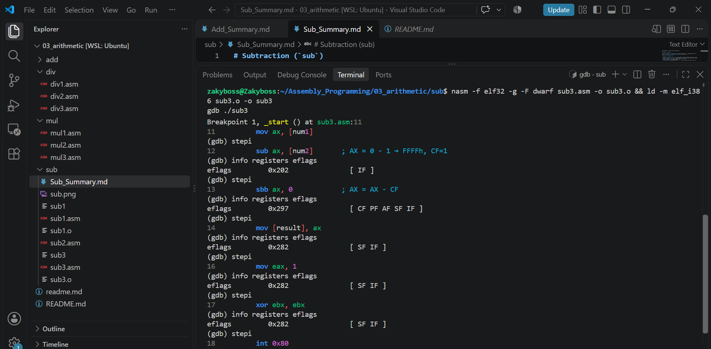

# Subtraction (`sub`)

`SUB` computes `destination - source`. For subtraction, **CF means borrow**: it is set when the unsigned source is larger than the destination.

## Program 1: `sub1.asm`

Subtracts `80 (0x50)` from `50 (0x32)` in the 8-bit register `AL`. I stepped through it with `stepi` and checked `info registers eflags` after each instruction.

### Flags as the program runs

- **Start of `_start`:** `[ IF ]`. IF is set by the OS, and the arithmetic flags are all clear.
- **`mov al, [num1]`:** `AL = 0x32`, flags unchanged. `MOV` doesn't touch the arithmetic flags.
- **`sub al, [num2]`:** `AL = 0xE2`, flags become `[ CF PF SF IF ]`.
- **`mov [result], al`:** flags unchanged.
- **`xor ebx, ebx`:** flags become `[ PF ZF IF ]`. `XOR` overwrites the results of the `sub`.

### Why each flag after the `sub`

`00110010 - 01010000 = 11100010` (`0xE2`, which is 226 unsigned and -30 signed)

- **CF set:** 50 is smaller than 80, so the subtraction had to borrow from beyond bit 7. As unsigned, 50 - 80 is negative, which can't be represented, and the result wrapped to 226.
- **ZF cleared:** the result is not zero.
- **SF set:** bit 7 of the result is 1. As signed, this is -30, the correct answer.
- **OF cleared:** the signed answer -30 fits in the range -128 to 127, so there is no signed overflow. Subtracting two positive numbers can never overflow.
- **PF set:** the low byte `11100010` has four 1-bits, which is an even count.
- **AF cleared:** the low nibbles `0x2 - 0x0` need no borrow from bit 4.

CF = 1 and SF = 1, but OF = 0. As unsigned the subtraction underflowed, as signed it gave a correct negative result, and CF and OF report these two views separately.

## Program 2: `sub3.asm`

Subtracts `1` from `0` in the 16-bit register `AX`, then uses `SBB` to subtract the borrow.

### Flags as the program runs

- **`mov ax, [num1]`:** `AX = 0x0000`, flags stay `[ IF ]`.
- **`sub ax, [num2]`:** `AX = 0xFFFF`, flags become `[ CF PF AF SF IF ]`.
- **`sbb ax, 0`:** `AX = 0xFFFE`, flags become `[ SF IF ]`.
- **`mov [result], ax`:** flags unchanged.

### Why each flag after `sub ax, [num2]`

`0000000000000000 - 0000000000000001 = 1111111111111111`

- **CF set:** 0 is smaller than 1, so a borrow came from beyond bit 15. The result wrapped around to 65535.
- **ZF cleared:** the result is not zero.
- **SF set:** bit 15 is 1. As signed this is -1, the correct answer.
- **OF cleared:** 0 - 1 = -1 fits in the signed 16-bit range.
- **PF set:** PF checks only the low byte, `11111111`, which has eight 1-bits, an even count.
- **AF set:** the low nibbles `0x0 - 0x1` had to borrow from bit 4.

### Why each flag after `sbb ax, 0`

`SBB` computes `AX - 0 - CF`. CF was 1, so `0xFFFF - 0 - 1 = 0xFFFE`.

- **CF cleared:** `0xFFFF` is larger than the 1 being subtracted, so no borrow is needed. The old CF was consumed as the borrow-in.
- **ZF cleared:** the result is not zero.
- **SF set:** bit 15 is still 1.
- **OF cleared:** no signed overflow.
- **PF cleared:** the low byte `11111110` has seven 1-bits, an odd count.
- **AF cleared:** the low nibbles `0xF - 0 - 1 = 0xE` need no borrow.

`SBB` is the subtraction version of `ADC`. It subtracts the borrow (CF) left by an earlier `sub`, which is how subtraction chains across multiple words. Its flags are then recalculated from its own result.